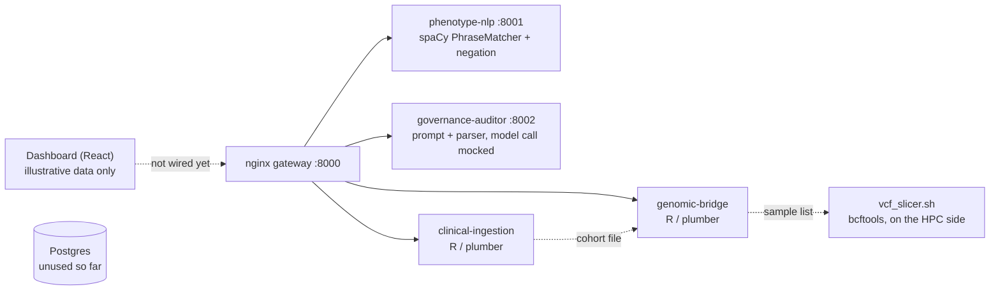

# Gut Reaction Platform

[](https://github.com/dsugurtuna/gut-reaction-platform/actions/workflows/ci.yml)
[](LICENSE)

A reference implementation of a small clinical research data platform: four services that flag
clinical events in free text, check redacted documents for leaked identifiers, standardise hospital
prescribing extracts and link a clinical cohort to genomic sample IDs. Some parts work end to end;
others are scaffolds with mocked calls. The table under [What works today](#what-works-today) says
which is which.

## The problem

Research on conditions such as inflammatory bowel disease (IBD) needs three kinds of data that
usually live apart:

- clinical records from several hospitals, each with its own column names, date formats and drug
  spellings;
- free-text reports (radiology, discharge letters) where important events, such as a venous
  thromboembolism (VTE), are written down but rarely coded;
- genomic data on a separate high-performance computing (HPC) system, which may only be joined to
  clinical data through a pseudonymised ID bridge.

Before anything leaves the secure environment, someone also has to check outputs for small counts
and redaction failures. Doing each step by hand is slow and hard to repeat.

## What this does

Each step is a separate service with its own tests.

| Service | Language | What it does |
|---|---|---|
| `phenotype-nlp` | Python, FastAPI, spaCy | Flags VTE mentions in a report and ignores negated ones ("no evidence of PE"). |
| `governance-auditor` | Python, FastAPI | Designed to ask a vision-language model to look for PII in redacted pages. **The model call is mocked.** |
| `clinical-ingestion` | R, plumber | Reads one prescribing extract (Excel), standardises columns, dates and four biologic drug names, and drops rows that fail two checks. |
| `genomic-bridge` | R, plumber | Joins a clinical cohort to an ID bridge and a sample manifest, and keeps samples that pass QC and have data files. |

Around them: an nginx gateway config, a React dashboard shell, Kubernetes manifests, Terraform for
AWS, and a GitHub Actions pipeline.

### What works today

| Part | Status |
|---|---|
| VTE extraction (`phenotype-nlp`) | Works. Rule-based: 9 terms, whole-word negation cues in a 6-token window before the term. Not evaluated against annotated reports. `confidence` is a fixed 0.95 placeholder, not a probability. |
| SciSpacy | Optional. The service asks for `en_core_sci_md` but the image does not install SciSpacy, so it falls back to spaCy's `en_core_web_sm`. Matching only uses the tokenizer, so results are the same. |
| Visual PII audit (`governance-auditor`) | Reference implementation with a mocked model call. The prompt, response schema, parsing and fail-closed handling are real; `_call_vlm_api` returns the same canned answer for every file, and the file is never read. Responses carry `"mocked": true`. |
| Prescribing harmonisation (`clinical-ingestion`) | Works on Excel input. Output is a flat table, **not** the OMOP Common Data Model: there are no concept IDs or vocabularies. |
| Genomic linkage (`genomic-bridge`) | The join and QC rules work and are tested. File paths are fixed placeholders. `GET /status/{id}` is a mock. The code does not create or hash identifiers; it expects a bridge table made elsewhere. `vcf_slicer.sh` wraps bcftools and is untested. |
| Small-cell check (`disclosure_control_check.R`) | Flags any value of a categorical column with fewer than 5 rows. One column at a time, no cross-tabulations. Not wired to an API and not tested. |
| Dashboard (`ui/`) | Builds in CI. One page of hard-coded, labelled illustrative numbers and three "coming soon" pages. It does not call the services. |
| Postgres and Redis | Started by Docker Compose. No service uses them yet. |
| Kubernetes (`infrastructure/k8s/base`) | Rendered and checked against the Kubernetes 1.28 schemas in CI. Never deployed. Defines the two Python services only (the Ingress also routes to the R services, which have no manifests), and refers to a ServiceAccount, volumes and a Secret it does not define. Default-deny NetworkPolicies; Prometheus scrape annotations but no `/metrics` endpoint. |
| Terraform (`infrastructure/terraform/aws`) | VPC, EKS 1.28, RDS PostgreSQL with a KMS key, ElastiCache Redis. Never applied, and not validated in CI. |
| Authentication | None. No endpoint checks who is calling. |

The repository contains no patient data. Tests and examples use short invented sentences and tables.

## Quickstart

These commands run the same checks as CI. They need Python 3.11, and R with `testthat`, `dplyr`,
`tibble`, `stringr` and `checkmate` for the R tests. No API keys and no Docker.

```bash
git clone https://github.com/dsugurtuna/gut-reaction-platform.git
cd gut-reaction-platform
make test     # Python (pytest) and R (testthat) unit tests; creates .venv-nlp and .venv-auditor
make lint     # ruff 0.16.9, as pinned in CI
make ui       # needs Node.js 22: type-check and build the dashboard
```

To run the two Python services and call them (needs Docker; this is what the CI integration job does):

```bash
make up
curl -s http://localhost:8001/health
curl -s -X POST http://localhost:8001/extract/vte \
  -H "Content-Type: application/json" \
  -d '{"patient_id": "P001", "encounter_id": "E001", "text_content": "CT shows acute pulmonary embolism. No DVT."}'
make down
```

The second call returns:

```json
{"patient_id":"P001","status":"POSITIVE_VTE","has_vte":true,"confidence":0.95,"evidence":["pulmonary embolism"]}
```

"DVT" is left out of the evidence because "No" comes just before it. `make up-all` starts every
container, including the R services, gateway and dashboard; CI does not test that stack.

## How it works


```mermaid
flowchart LR
    UI["Dashboard (React)<br/>illustrative data only"] -.->|not wired yet| GW
    GW["nginx gateway :8000"] --> NLP["phenotype-nlp :8001<br/>spaCy PhraseMatcher + negation"]
    GW --> AUD["governance-auditor :8002<br/>prompt + parser, model call mocked"]
    GW --> ING["clinical-ingestion<br/>R / plumber"]
    GW --> BRG["genomic-bridge<br/>R / plumber"]
    ING -.->|cohort file| BRG
    BRG -.->|sample list| VCF["vcf_slicer.sh<br/>bcftools, on the HPC side"]
    PG[("Postgres<br/>unused so far")]
```

1. **Harmonise.** `process_trust_prescribing()` reads an extract, lower-cases column names, maps
   drug names such as "Humira Pen" to "Adalimumab", parses dates in several formats and keeps rows
   with a valid date and a target drug. It logs how many rows it dropped.
2. **Extract phenotypes.** `VTEExtractor` matches VTE terms and drops a match when a cue such as
   "no", "not", "ruled out" or "negative for" appears as a whole word in the six tokens before it.
3. **Link.** `link_cohort()` inner-joins the cohort to the bridge table; `select_exportable()` keeps
   samples with `qc_status == "PASS"`, contamination below 5% and at least one data file.
4. **Check outputs.** The auditor is meant to catch what text rules miss (names in margins,
   see-through redaction boxes). Until a real model is connected it returns a canned result, and
   any response it cannot parse counts as unsafe.

More detail: [docs/ARCHITECTURE.md](docs/ARCHITECTURE.md), [docs/API.md](docs/API.md),
[docs/DEPLOYMENT.md](docs/DEPLOYMENT.md), and the reasoning behind each choice in
[docs/WHY.md](docs/WHY.md).

## Design decisions

- **Rules before models for VTE.** A term list plus negation cues is easy to read, check and
  explain, and it is the baseline any trained model has to beat. The next step is to measure it on
  annotated reports, not to replace it.
- **Negation cues match whole words.** Substring matching treated "known", "diagnosis" and
  "normal" as containing "no" and hid real findings. There are regression tests for this.
- **The mocked auditor says it is mocked.** `/health`, every response and the logs report
  `mocked`, so nobody mistakes a canned answer for a real check. Parse failures fail closed.
- **R for tabular clean-up, Python for the APIs around text.** The harmonisation and linkage steps
  are data-frame work that R and dplyr express compactly. The pure rules live in their own files so
  the tests exercise the same code the services run.
- **One service per step.** Each step has different dependencies and a different risk. Keeping
  them apart means the text service never needs genomic paths, and the linkage service never sees
  free text.
- **CI tests behaviour, not only start-up.** The integration job builds the images, calls the
  endpoints and checks the response bodies. A 500 response used to pass.

## Limitations and what this is not

- It is not deployed anywhere and has never processed real patient data.
- It is not an OMOP CDM pipeline, and it does not certify compliance with any framework.
- The VTE rules have not been evaluated, so there is no accuracy figure. Known gaps: cues after the
  term ("PE unlikely") are missed, and the window can cross sentence boundaries.
- The visual PII check does not look at the document yet.
- No authentication, no TLS between services, and a default Postgres password in the compose files.
- The Terraform turns on `log_statement = all` for RDS, which would write query values to logs.
  Review that before using it with sensitive data.
- The Kubernetes network policies deny all egress, so pods could not resolve DNS or reach a database
  without further rules.

## Roadmap

1. Evaluate the VTE extractor on a small, openly licensed or synthetic annotated set; report
   precision and recall with the command that produces them.
2. Connect a real vision-language model behind a feature flag, render PDF pages to images, and keep
   the fail-closed parser.
3. Map harmonised prescriptions to OMOP `drug_exposure` with real concept IDs, or stop using the
   term.
4. Add authentication to the APIs and a Kubernetes overlay with the missing ServiceAccount,
   volumes, Secret and egress rules; validate the Terraform in CI.

## Licence

Apache License 2.0. See [LICENSE](LICENSE).

---

Personal project by [Ugur Tuna](https://github.com/dsugurtuna). Not affiliated with or endorsed by
any employer.
