<div align="center">

# 🧬 Gut Reaction Platform

### Secure Multi-Modal Health Data Infrastructure for IBD Research

[](https://github.com/dsugurtuna/gut-reaction/actions)
[](LICENSE)
[](https://python.org)
[](https://r-project.org)
[](https://docker.com)
[](https://kubernetes.io)

[](https://ukdataservice.ac.uk/help/secure-lab/what-is-the-five-safes-framework/)
[](https://gdpr.eu)
[](https://www.iso.org/isoiec-27001-information-security.html)

<p align="center">
  <strong>Enterprise-grade federated data platform bridging clinical phenotypes and genomic assets for Inflammatory Bowel Disease (IBD) research.</strong>
</p>

[**📖 Documentation**](docs/) · [**🚀 Quick Start**](#-quick-start) · [**🏗 Architecture**](docs/ARCHITECTURE.md) · [**📡 API Reference**](docs/API.md) · [**🤝 Contributing**](CONTRIBUTING.md)

</div>

---

## 📋 Table of Contents

- [Overview](#-overview)
- [Key Features](#-key-features)
- [Architecture](#-architecture)
- [Services](#-services)
- [Quick Start](#-quick-start)
- [Configuration](#-configuration)
- [Deployment](#-deployment)
- [API Reference](#-api-reference)
- [Security & Compliance](#-security--compliance)
- [Performance](#-performance)
- [Contributing](#-contributing)
- [License](#-license)

---

## 🎯 Overview

The **Gut Reaction Platform** is a production-ready, microservices-based data infrastructure designed to solve a critical challenge in translational medicine: **securely integrating clinical phenotypes from NHS Trusts with genomic data from High Performance Computing (HPC) environments**.

### The Problem

```
┌──────────────────────┐          🚫 AIR GAP 🚫          ┌──────────────────────┐
│   NHS Trust TRE      │ ◄────── Cannot Connect ──────► │   Sanger HPC         │
│   (Clinical Data)    │                                 │   (Genomic Data)     │
│   - Patient Records  │                                 │   - WES/WGS CRAM     │
│   - Prescriptions    │                                 │   - GWAS Arrays      │
│   - Lab Results      │                                 │   - VCF Files        │
└──────────────────────┘                                 └──────────────────────┘
```

### The Solution

A **federated architecture** where clinical data never leaves the Trusted Research Environment (TRE), and only de-identified tokens cross the air gap. The platform features AI-powered governance that automates compliance checks using Vision-Language Models.

```
┌─────────────────────────────────────────────────────────────────────────────┐
│                         GUT REACTION PLATFORM                                │
│  ┌─────────────┐   ┌─────────────┐   ┌─────────────┐   ┌─────────────┐     │
│  │  Clinical   │   │  Phenotype  │   │  Genomic    │   │  Visual AI  │     │
│  │  Ingestion  │──►│    NLP      │──►│   Bridge    │──►│  Auditor    │     │
│  │   (R)       │   │  (Python)   │   │    (R)      │   │  (Python)   │     │
│  └─────────────┘   └─────────────┘   └─────────────┘   └─────────────┘     │
│         │                 │                 │                 │             │
│         └─────────────────┴─────────────────┴─────────────────┘             │
│                                     │                                        │
│                            ┌────────▼────────┐                              │
│                            │   PostgreSQL    │                              │
│                            │   (Audit Logs)  │                              │
│                            └─────────────────┘                              │
└─────────────────────────────────────────────────────────────────────────────┘
```

---

## ✨ Key Features

<table>
<tr>
<td width="50%">

### 🤖 AI-Driven Visual Governance
Automate the "Five Safes" framework using **Vision-Language Models** (LLaVA/GPT-4V) that visually inspect redacted documents—catching what regex-based tools miss.

```python
# Catches visual PII leakage
auditor.audit_document("redacted_report.pdf")
# ✓ Transparent redaction boxes
# ✓ Names in margins
# ✓ PII in embedded images
```

</td>
<td width="50%">

### 🔐 Zero-Trust Air Gap Linkage
Clinical data **never leaves** the TRE. Only cryptographically-hashed, de-identified tokens cross to the HPC environment.

```r
# Clinical IDs → Opaque Tokens
link_clinical_to_genomic(
  clinical_cohort,    # Stays in TRE
  linkage_key,        # Encrypted bridge
  genomic_manifest    # HPC side
)
```

</td>
</tr>
<tr>
<td width="50%">

### 🏥 OMOP CDM Harmonization
Ingest raw NHS Trust extracts (Excel, CSV) and transform them into the [OMOP Common Data Model](https://ohdsi.github.io/CommonDataModel/) for standardized analysis.

```r
# Handles: Different column names,
# date formats, drug name variants
process_trust_prescribing(
  file_path = "CAMBS_data.xlsx",
  trust_id = "CAMBS"
)
```

</td>
<td width="50%">

### 📝 Clinical NLP Pipeline
Extract deep phenotypes (VTE history, disease severity, treatment response) from unstructured clinical notes using **SciSpacy** and context-aware negation detection.

```python
# "No evidence of PE" → Negative
# "History of DVT"    → Positive
extractor.process_batch(clinical_notes)
```

</td>
</tr>
</table>

---

## 🏗 Architecture

The platform follows a **microservices architecture** with clear separation of concerns:

```mermaid
graph TB
    subgraph "🌐 Frontend"
        UI[React Dashboard :3000]
    end
    
    subgraph "🚪 Gateway"
        NGINX[NGINX API Gateway :8000]
    end
    
    subgraph "🔬 Processing Services"
        NLP[Phenotype NLP :8001]
        ING[Clinical Ingestion :8002]
        GOV[Visual Auditor :8003]
        BRG[Genomic Bridge :8004]
    end
    
    subgraph "💾 Data Layer"
        PG[(PostgreSQL)]
        RD[(Redis Cache)]
    end
    
    subgraph "🖥️ HPC Environment"
        SL[Slurm Cluster]
        VCF[Genomic Data Lake]
    end
    
    UI --> NGINX
    NGINX --> NLP
    NGINX --> ING
    NGINX --> GOV
    NGINX --> BRG
    
    NLP --> PG
    ING --> PG
    GOV --> PG
    BRG -.->|De-identified tokens| SL
    SL --> VCF
```



**📚 [Full Architecture Documentation →](docs/ARCHITECTURE.md)**

---

## 🔧 Services

| Service | Port | Tech Stack | Purpose |
|---------|------|------------|---------|
| **Dashboard** | `3000` | React, TypeScript, TailwindCSS | Researcher interface for cohort building |
| **API Gateway** | `8000` | NGINX | Request routing, rate limiting, SSL termination |
| **Phenotype NLP** | `8001` | Python, FastAPI, SciSpacy | Extract clinical phenotypes from free text |
| **Clinical Ingestion** | `8002` | R, Plumber, Tidyverse | ETL pipeline for NHS Trust data |
| **Visual Auditor** | `8003` | Python, PyTorch, LLaVA | AI-powered PII detection in documents |
| **Genomic Bridge** | `8004` | R, Bioconductor | Secure clinical-genomic linkage |

---

## 🚀 Quick Start

### Prerequisites

| Requirement | Version | Purpose |
|-------------|---------|---------|
| [Docker](https://docker.com) | 20.10+ | Container runtime |
| [Docker Compose](https://docs.docker.com/compose/) | 2.0+ | Multi-container orchestration |
| [Make](https://www.gnu.org/software/make/) | 3.81+ | Build automation (optional) |

### Installation

```bash
# 1. Clone the repository
git clone https://github.com/dsugurtuna/gut-reaction.git
cd gut-reaction

# 2. Copy environment configuration
cp .env.example .env

# 3. Start all services
make up
# or: docker-compose up --build -d

# 4. Verify services are running
make status
# or: docker-compose ps
```

### Access Points

| Service | URL | Credentials |
|---------|-----|-------------|
| **Dashboard** | http://localhost:3000 | Demo mode |
| **NLP API Docs** | http://localhost:8001/docs | OpenAPI/Swagger |
| **Auditor API** | http://localhost:8003/docs | OpenAPI/Swagger |
| **PostgreSQL** | localhost:5432 | `admin / secure_password` |

### Test the API

```bash
# Health check
curl http://localhost:8001/health

# Extract VTE phenotype from clinical note
curl -X POST http://localhost:8001/extract/vte \
  -H "Content-Type: application/json" \
  -d '{
    "patient_id": "P001",
    "encounter_id": "E001",
    "text_content": "Patient presents with acute pulmonary embolism in the left lung."
  }'
```

**Expected Response:**
```json
{
  "patient_id": "P001",
  "has_vte": true,
  "confidence": 0.95,
  "evidence": ["pulmonary embolism"]
}
```

---

## ⚙️ Configuration

### Environment Variables

Create a `.env` file from the template:

```bash
cp .env.example .env
```

| Variable | Default | Description |
|----------|---------|-------------|
| `POSTGRES_USER` | `admin` | Database username |
| `POSTGRES_PASSWORD` | `secure_password` | Database password |
| `POSTGRES_DB` | `gut_reaction_db` | Database name |
| `VLM_API_KEY` | - | OpenAI/HuggingFace API key for Visual Auditor |
| `VLM_MODEL` | `llava-v1.5-7b` | Vision-Language Model to use |
| `LOG_LEVEL` | `INFO` | Logging verbosity |

### Service Configuration

Each service can be configured via its own `config/` directory:

```
services/
├── phenotype-nlp/
│   └── config/
│       ├── models.yaml      # Spacy model settings
│       └── ontology.yaml    # VTE term dictionary
├── governance-auditor/
│   └── config/
│       └── prompts.yaml     # VLM prompt templates
└── clinical-ingestion/
    └── config/
        └── trust_mappings/  # Per-Trust column mappings
```

---

## 🚢 Deployment

### Local Development (Docker Compose)

```bash
make up        # Start all services
make logs      # View logs
make down      # Stop all services
make clean     # Remove volumes and images
```

### Production (Kubernetes)

```bash
# Apply Kubernetes manifests
kubectl apply -k infrastructure/k8s/overlays/production/

# Or use Helm (coming soon)
helm install gut-reaction ./charts/gut-reaction
```

### Cloud (Terraform)

```bash
cd infrastructure/terraform/aws

# Initialize and apply
terraform init
terraform plan
terraform apply
```

**📚 [Full Deployment Guide →](docs/DEPLOYMENT.md)**

---

## 📡 API Reference

### Phenotype NLP Service

#### `POST /extract/vte`

Extract VTE (Venous Thromboembolism) signals from clinical text.

**Request:**
```json
{
  "patient_id": "string",
  "encounter_id": "string",
  "text_content": "string",
  "metadata": {}
}
```

**Response:**
```json
{
  "patient_id": "string",
  "has_vte": true,
  "confidence": 0.95,
  "evidence": ["pulmonary embolism", "DVT"]
}
```

#### `POST /batch/process`

Submit multiple notes for background processing.

---

### Visual Governance Auditor

#### `POST /audit/document`

Upload a document (PDF/image) for visual PII inspection.

**Response:**
```json
{
  "filename": "report.pdf",
  "is_safe": false,
  "risk_score": 0.95,
  "detected_issues": [
    "Patient Name: Sarah Jones (top-left header)",
    "DOB visible in footer"
  ]
}
```

**📚 [Full API Documentation →](docs/API.md)**

---

## 🔒 Security & Compliance

### Framework Alignment

| Framework | Status | Details |
|-----------|--------|---------|
| **NHS Five Safes** | ✅ Compliant | Safe People, Safe Projects, Safe Settings, Safe Data, Safe Outputs |
| **GDPR** | ✅ Compliant | Data minimization, audit trails, right to erasure |
| **ISO 27001** | ✅ Deployed in certified TRE | AIMES Research Environment |
| **OWASP Top 10** | ✅ Mitigated | Input validation, auth, logging |

### Security Features

- 🔐 **Zero-Trust Architecture**: Services authenticate via mTLS
- 📋 **Audit Trails**: All data access logged to immutable audit log
- 🚫 **Data Minimization**: VCF slicer extracts only requested variants
- 👁️ **Visual PII Detection**: AI catches what regex misses
- 🔒 **Secrets Management**: Kubernetes Secrets / HashiCorp Vault

**📚 [Security Documentation →](SECURITY.md)**

---

## 📊 Performance

### Benchmarks

| Metric | Value | Notes |
|--------|-------|-------|
| NLP Throughput | 500 notes/min | Batch processing with `nlp.pipe()` |
| VCF Extraction | 10,000 samples/hr | bcftools on 64-core HPC node |
| Visual Audit | 3 sec/page | GPT-4V API latency |
| API Latency (P95) | <200ms | Single note extraction |

### Scalability

```
                    ┌─────────────────┐
                    │  Load Balancer  │
                    └────────┬────────┘
                             │
         ┌───────────────────┼───────────────────┐
         │                   │                   │
    ┌────▼────┐        ┌────▼────┐        ┌────▼────┐
    │ NLP Pod │        │ NLP Pod │        │ NLP Pod │
    │  (GPU)  │        │  (GPU)  │        │  (GPU)  │
    └─────────┘        └─────────┘        └─────────┘
```

Horizontal Pod Autoscaler configured for 3-10 replicas based on CPU/Memory.

---

## 🤝 Contributing

We welcome contributions! Please see our [Contributing Guide](CONTRIBUTING.md) for details.

```bash
# Fork and clone
git clone https://github.com/YOUR_USERNAME/gut-reaction.git

# Create feature branch
git checkout -b feature/amazing-feature

# Make changes and test
make test

# Submit PR
git push origin feature/amazing-feature
```

**📚 [Contribution Guidelines →](CONTRIBUTING.md)**

---

## 📄 License

This project is licensed under the **Apache License 2.0** - see the [LICENSE](LICENSE) file for details.

---

## 🙏 Acknowledgments

- [NIHR BioResource](https://bioresource.nihr.ac.uk/) - Clinical cohort access
- [Wellcome Sanger Institute](https://www.sanger.ac.uk/) - Genomic infrastructure
- [OHDSI OMOP CDM](https://ohdsi.org/) - Common data model specification
- [SciSpacy](https://allenai.github.io/scispacy/) - Biomedical NLP models

---

<div align="center">

**Built with ❤️ for translational medicine research**

[Ugur Tuna](https://github.com/dsugurtuna) · Technical Project Lead & Architect

[](https://github.com/dsugurtuna)
[](https://linkedin.com/in/ugurtuna)

</div>
