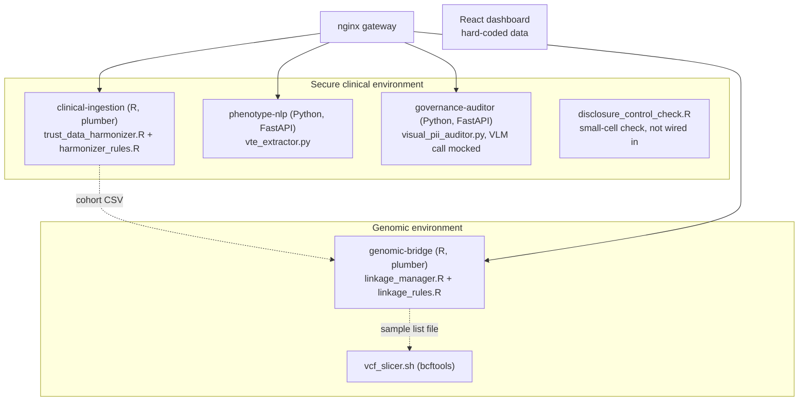

# System architecture

This page describes what is in the repository today. Parts that are designed but not built are
listed at the end, so the two are not confused. For the reasons behind each choice, see
[WHY.md](WHY.md).

## Overview

The platform is split into four services, one per processing step, plus supporting pieces.

Dotted arrows are hand-offs by file. No service calls another over HTTP, and nothing reads from or
writes to Postgres or Redis yet.

## Components

### phenotype-nlp

- `vte_extractor.py`: `VTEExtractor` builds a spaCy `PhraseMatcher` over nine VTE terms, matched
  on lower-cased tokens. A match is negated if a cue ("no", "not", "negative for", "free of",
  "ruled out", "absence of", "no evidence of", "unlikely", "doubtful") appears as a whole word in
  the six tokens before it. The document is `POSITIVE_VTE` if any match survives, `NEGATIVE_VTE`
  if all were negated, and `NO_MENTION` otherwise.
- Model loading tries `MODEL_PATH` (default `en_core_sci_md`, the SciSpacy model), then
  `en_core_web_sm`, then a blank English tokenizer. The image installs `en_core_web_sm` only.
  Only tokenisation is used, so the choice does not change matches.
- `main.py`: FastAPI app with `/health`, `/extract/vte` and `/batch/process`. The batch endpoint
  runs the extractor in a background task and logs counts per status; results are not stored.

### governance-auditor

- `visual_pii_auditor.py`: builds the audit prompt, calls the model and parses a JSON reply into an
  `AuditResult`. `_encode_image` returns a placeholder string and `_call_vlm_api` returns one
  canned reply, so **every document gets the same result**. `MOCKED = True` records this and is
  reported by the API. If the reply cannot be parsed the result is unsafe with risk 1.0.
- `main.py`: FastAPI app with `/health` and `/audit/document` (multipart upload). Uploads go to a
  private temporary file named without the client's filename, and are deleted afterwards.
- `disclosure_control_check.R`: flags values of a categorical column that appear fewer than
  `threshold` (default 5) times. It checks one column at a time and is not called by any service.
  The auditor image has no R runtime.

### clinical-ingestion

- `harmonizer_rules.R`: `standardise_drug()` maps generic and brand names for infliximab,
  adalimumab, vedolizumab and ustekinumab by case-insensitive regex; `normalise_column_names()`;
  and `VALID_TRUST_IDS`, the four accepted site codes.
- `trust_data_harmonizer.R`: `process_trust_prescribing(file_path, trust_id)` reads an Excel file,
  applies the rules, parses `rx_date` with several formats, keeps rows with a valid date and a
  target drug, and warns with the number of rows dropped. The output is a flat table with
  `trust_id, patient_id, drug_name_std, start_date, dose, frequency`. It is not OMOP CDM.
- `start_api.R`: plumber routes `/health` and `POST /harmonize?input_file=...&trust_id=...`. The
  file path is a path on the server; there is no upload.

### genomic-bridge

- `linkage_rules.R`: `link_cohort()` inner-joins the cohort to the bridge table on `patient_id`
  and drops rows without a `sanger_sample_id`; `select_exportable()` keeps samples with
  `qc_status == "PASS"`, `contamination_rate < 0.05` and a WES or SNP file.
- `linkage_manager.R`: `link_clinical_to_genomic()` reads the three CSVs, checks required columns,
  checks for CRAM and PLINK files under fixed `/mnt/hpc/data/...` paths, and applies the rules.
- `start_linkage_service.R`: plumber routes `/health`, `/status/<patient_id>` (a mock that always
  reports a link) and `POST /link-cohort` (fixed bridge and manifest paths).
- `vcf_slicer.sh`: runs `bcftools view` for a sample list and region, removes the ID and QUAL
  columns and the AF and AC INFO fields with `bcftools annotate`, then runs `bgzip` and `tabix`.
  Not tested in this repository.

The code expects the ID bridge to be produced and held by someone else. It does not generate,
hash or encrypt identifiers.

### Supporting pieces

| Piece | Where | Notes |
|---|---|---|
| Gateway | `infrastructure/nginx/nginx.conf` | Routes `/extract/` and `/health` to phenotype-nlp, `/audit/` to the auditor, `/ingest/` and `/linkage/` to the R services (prefix stripped). No TLS, no rate limiting, no auth. |
| Dashboard | `ui/` | React, Vite, Tailwind. Hard-coded illustrative numbers; three placeholder pages. Its `/api` proxy is not used by any page. |
| Postgres, Redis | `docker-compose.yml` | Started, not used. |
| Kubernetes | `infrastructure/k8s/base` | See [DEPLOYMENT.md](DEPLOYMENT.md). |
| Terraform | `infrastructure/terraform/aws` | See [DEPLOYMENT.md](DEPLOYMENT.md). |

## Ports

| Container | Port inside | Published by `docker-compose.yml` | Published by `docker-compose.ci.yml` |
|---|---|---|---|
| phenotype-nlp | 8001 | no (reach it through the gateway) | 8001 |
| governance-auditor | 8002 | no | 8002 |
| clinical-ingestion | 8000 | no | not started |
| genomic-bridge | 8000 | no | not started |
| api-gateway | 80 | 8000 | not started |
| dashboard | 3000 | 3000 | not started |
| postgres | 5432 | no | no |
| redis | 6379 | 6379 | not started |

## Designed but not built

Earlier versions of this page described these as if they existed. They do not:

- authentication (Keycloak, JWT) and mutual TLS between services;
- an immutable audit log, or any audit table in Postgres;
- message queues between services;
- a Slurm integration or any HPC job submission;
- a real vision-language model backend;
- OMOP CDM mapping;
- Prometheus metrics endpoints and dashboards;
- a Helm chart.
